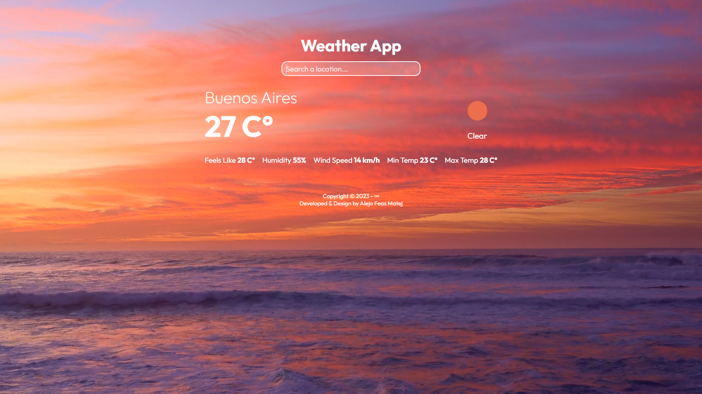

# Weather App ⛅

Weather App es una aplicación web que devuelve el clima en tiempo real de la ubicación que recibe. Desarrollada con [**React JS**](https://reactjs.org/).

## Tecnologías 🛠️

- [**React JS**](https://reactjs.org/)
- [**SASS**](https://sass-lang.com/install)

## Librerías 📚

- [**React Toastify**](https://www.npmjs.com/package/react-toastify)

## Autor ✍

- **Alejo Feas Matej** - *FullStack Web Developer en formación* - [alefeas](https://github.com/alefeas)

## Licencias 📃

Cualquier persona es libre de analizar, estudiar, copiar o mejorar este proyecto. Se agradecerá citar esta fuente cuando sea usado.